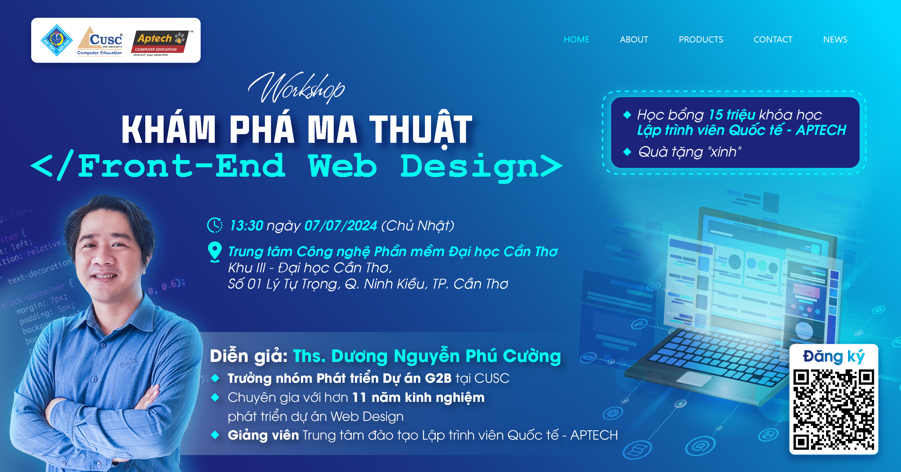

# https://nentang.vn
- Các bài học miễn phí về Lập trình
- Học web Frontend cơ bản HTML-CSS-JS
- Trang web demo http://learning.nentang.vn
- Xem nhiều hơn tại https://nentang.vn

# Học là phải THỰC HÀNH ❤🧡💛💚💙💜🤎

# Workshop Magic Behind Frontend

- Thời gian: 13h30 ngày 07/07/2024 (Chủ Nhật)
- Địa chỉ: Khu III - Đại học Cần Thơ; Số 01 Lý Tự Trọng, Quận Ninh Kiều, TP Cần Thơ

- Diễn giả: Ths. Dương Nguyễn Phú Cường
- Trưởng nhóm Phát triển Dự án G2B tại CUSC.
- Chuyên gia với hơn 11 năm kinh nghiệm phát triển dự án Web Design.
- Giảng viên Trung tâm Đào tạo Lập trình viên Quốc tế - APTECH.

# Demo
- Xem video demo sau...

# Các chương trình cần thiết để lập trình web
- Visual Studio Code IDE - trình gõ code - [Visual Studio Code](https://code.visualstudio.com/)
- [Git for window](https://git-scm.com/download/win)
- TortoiseGIT - [TortoiseGIT](https://tortoisegit.org/download/)